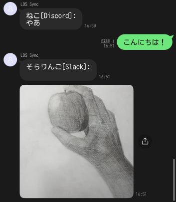
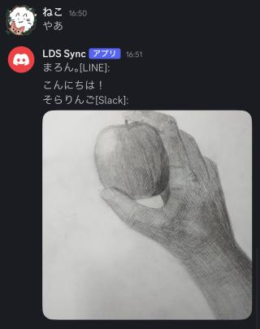
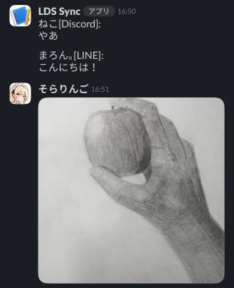

# LDS Sync

LINE Discord Slack Sync  
LINE, Discord, Slackのグループチャット・チャンネルを同期させます。

## Sample

<details>
  <summary>Images</summary>

  LINE:  
    
  Discord:  
    
  Slack:  
    

</details>

## Required

### Packages

- Node.js v20以上 (v22推奨)
- PM2 v6以上
- Nginx / Apache
- Certbot

### Main Wrappers

- [@line/bot-sdk](https://www.npmjs.com/package/@line/bot-sdk)
- [@slack/bolt](https://www.npmjs.com/package/@slack/bolt)
- [discord.js](https://www.npmjs.com/package/discord.js)

## Setup

```bash
git clone https://github.com/otoneko1102/lds-sync.git
cd lds-sync
npm install
```

[example.env](./example.env) を参考に `.env` に各サービスのトークンなどを格納してください。LINE GroupID取得手順は下を参照。

- [LINE Developer Console](https://developers.line.biz/console/)
- [Discord Developr Portal](https://discord.com/developers/applications)
- [Slack API](https://api.slack.com/apps)

```bash
npm run build
# 一時起動の場合
npm run start
# 常時起動の場合
pm2 start dist/index.js --name lds-sync
pm2 startup
pm2 save
```

### LINE GroupID取得手順

※ `LINE_WEBHOOK_DOMAIN` はhttps化必須なのでSSL対応の `Apache` / `Nginx` などを利用して、 `Certbot` などでパスを通してください。

1. `npm run getlinegid` を起動し、LINE GroupID取得用のスクリプトを動作させる。
2. `https://%LINE_WEBHOOK_DOMAIN%/webhook-get-id` を `https://manager.line.biz/account/@%YOUROFFICIALACCOUNT%/setting/messaging-api` の Webhook URL に格納し保存する。
3. 読み取りたいLINE GroupにBotを入れるか、すでに入っているGroupでメッセージを送信する。
4. ログにGroup IDが出力される。
5. 後の本機能起動のために Webhook URL に格納しているURLを `https://%LINE_WEBHOOK_DOMAIN%/webhook` に変更する。
